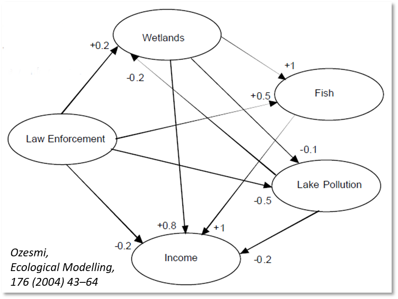
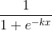

# FSDM  
Fuzzy Systems Dynamics Model Implemented with a Graphical User Interface

This project is the latest version of the Fuzzy Systems Dynamics Model (FSDM) and includes a graphical user interface for building and running FSDM models. It includes technical documentation of the FSDM modeling approach and a user's guide for the GUI software.

## What is the FSDM  
The Fuzzy Systems Dynamics Model is an alternative formulation of fuzzy cognitive map (FCM) models. [Fuzzy cognitive maps](https://en.wikipedia.org/wiki/Fuzzy_cognitive_map) are models of systems of interrelated concepts represented graphically as directed graphs. The following figure shows an example of an FCM that was developed to show relationships between factors affecting the use and management of a lake ecosystem and the benefits derived.

The nodes of the graph represent concepts that can have values between 0 and 1 representing relative magnitudes which can be thought of as a scale varying from low (0) to high (1). The arrows connecting the nodes represent causal effects with each arrow pointing from causal concept to the affected concept. Values on the arrows (edge weights) represent the relative strengths of causal effects which can vary between -1 and 1. A positive value means a positive effect while a negative value means a negative effect as is explained below. 

In the standard FCM formulation, the value of a node is calculated in two steps. A preliminary value is calculated  as the sum of the values of the nodes which affect it times their respective causal weights. An [activation function](https://en.wikipedia.org/wiki/Activation_function) is then applied to the preliminary value to constrain the final value of the node to the range of 0 to 1. Since FCMs typically include <a href="https://en.wikipedia.org/wiki/Cycle_(graph_theory)">cycles</a> the calculations must be repeated until values achieve some an equilibrium state or it is found that no equilibrium state exists.

Although the standard FCM formulation is called a __fuzzy__ cognitive map, it does not use [fuzzy logic](https://en.wikipedia.org/wiki/Fuzzy_logic) (such formulations have been developed however). The edge weights are real numbers, not [linguistic variables](https://en.wikipedia.org/wiki/Linguistic_value) representing [fuzzy sets](https://en.wikipedia.org/wiki/Fuzzy_set). Nevertheless, FCMs are considered to be fuzzy because they enable modeling to be done of problem domains that have system characteristics but are relatively data poor. Linguistic variables (e.g. high, medium, low) can be used to specify the strength of causal relationships and then mapped to real number values (e.g. medium = 0.5). 

Using FCMs in to model social systems poses some semantic issues as explained by [Carvalho](https://www.sciencedirect.com/science/article/pii/S0165011411005434). FCMs are neural networks with feedback. The mathematics of FCM (neural networks) pose challenges regarding whether causality is properly represented and whether the feedbacks represented in the networks adequately represent time.  

First, regarding the representation of causal relationships, it is important to recognize that the standard FCM formulation represents relationships between the values of concepts, not relationships between changes in the values of concepts. For example, in the FCM shown above the value of _Fish_ in each calculation iteration is equal to a function of the sum of the value of _Wetlands_ and 50% of the value of _Law Enforcement_ where the function is the activation function which keeps values within range (e.g. 0 to 1). Thus a change in the value of _Wetlands_ does not cause a change in the value of _Fish_, rather the value of _Wetlands_ determines the value of _Fish_. FCM mathematics show how an initial set of assumed concept values will evolve to either a new set of values or possibly to an indeterminate set of values (if new equilibrium is not created).

The problem of understanding how the standard FCM handles causality is well illustrated by considering how negative causal relationships are handled.  For example, in the FCM shown above, the _Lake Pollution_ concept is negatively affected by the _Wetlands_ and _Law Enforcement_ concepts. This makes sense if one thinks of the causal relationships in terms of changes. Increasing the quantity of wetlands and increasing the enforcement of environmental regulations should result in decreases in the amount of lake pollution. However, as explained above, that is not how the standard FCM computes causal effects, which is to compute a negative value for _Lake Pollution_ when the values of _Wetlands_ and _Law Enforcement_ are positive. This absurd result is made more sensible by processing it with the activation function which returns a value in the range from 0 to 1.  That is not a sensible result, but sensibility is returned by the activation function which converts negative values to positive ones. But then to understand how the standard FCM models causality, we need to understand the meaning of interaction of the causal map calculations along with the meaning of the activation function. 

To explore the interaction of causal map calculations and the activation function, consider a very simple cognitive map composed of only two concepts, a causal concept (_A_) and affected concept (_B_). Assume that the activation function is a logistic function having the standard form as described by Carvalho  

where the value of _k_ determines the rate of transition between 0 and 1. Furthermore, assume that the values of concepts are linearly scaled (e.g. a value of 1 is twice the value of 0.5). If the causal weight for A -> B is equal to 1, then one would expect that a change in _A_ would be mirrored by the same change in _B_. So for example if _A1_ is 0.5 and _A2_ is 0.55 (a 10% increase) then if we compare the values of _B1_ and _B2_ calculated from _A1_ and _A2_, then we would expect _B2_ to be 10% greater than _B1_. However, if we do the computations, we find that the change in _B_ is only about 1.9% if the value of _k_ in the activation function is equal to 1. If we assume the causal weight to be -1, then we should expect _B_ to decline by 10% when _A_ increases by 10%, but the calculations only show _B_ declining by about 3.1%.

the how concept states will evolve given an initial set of states. There is no guarantee that the 'evolution' will result in a new stable set of states or whether the result will oscillate between states indefinitely. don't Most important among these is that standard FCMs map out relationships between the values of concepts rather than relationships between changes in the concept values. Negative causal relationships are particularly problematical in this respect. Rather than meaning that if the value of a causal node increases, the value of the node that it affects decreases; it means that if the value of a causal node is positive, the value of the node it affects is negative. Since concepts can't have negative values, the  activation function that constrains values between 0 and 1 is used, the value of nodes affected by negative relationships will be converted to 0. The The model starts with a set of relative concept values (in the range of 0 to 1) and iterates until a new stable set of values is found or no stable set is found. This mathematical formulation is at odds with the common FCM description that the FCM depicts how changes in concepts affect one another and makes the interpretation of model results confusing. For example if the initial concept values are set to reflect current conditions and the model does not reach an equilibrium set of concept values that are the same as or close to the initial values, how should that result be interpreted? Does it mean that the model is poorly specified and should not be trusted or does it mean that the model is showing how future conditions will evolve from current conditions. And what would it mean if the model does not converge to some stable equilibrium or if it oscillates between several different states?  

The FSDM approach addresses the semantic and practical difficulties by follows the general approach in FCMs of representing concepts and connections between concepts using a directed graph and adjacency matrix. It departs from the FCM in that the value of each node a few ways. First, and most importantly, whereas with the effect of a concept on another is through the change in its value.  Edge weights can therefore be thought of as elasticities.  Second, in standard FCMs, when multiple concepts affect a concept, their combined effect is determined through summing the individual effects.  Since the FSDM works with percentage changes instead of absolute changes, the standard mathematical approach to combining percentage changes is used. Third, the activation function is replaced by sensitivity functions for causal and affected concepts. These functions modify the edge weights based on the respective values of the causal and affected concepts.

Fuzzy congnitive maps are applied to problem domains that have system characteristics but are relatively data poor and so specifying the system depends on expert knowledge. 

## Documentation  
Documentation of the FSDM and GUI software is contained in the 'documentation' directory.

## Installing and Running  
The FSDM can be run from the cloned or downloaded GitHub repository. To run the application, the [R language](https://www.r-project.org/) must be installed as well as several R packages. In addition, it is recommended that the [RStudio](https://www.rstudio.com/products/rstudio/download/) application be installed. The users guide in the documentation directory contains detailed instructions.

## History  
The FSDM method and code to implement it was first developed by the author to demonstrate an alternative to the  and user interface was developed under contract with the Oregon Department of Transportation (ODOT) as a part of a research project to develop a model for evaluating the potential impacts of new transportation technologies and services on travel behavior and transportation system performance. The FSDM method, code to implement it, and transportation model has been developed over the course of several years.

The basic FSDM method and original code to implement it was developed by the author as an alternative to commercial FCM modeling software being tested for use in a research project to test whether a FCM could be used to model the potential effects of new transportation technologies and services on travel behavior and transportation system performance. The author at the time was a member of the technical advisory committee reviewing the research being carried out by Oregon State University (OSU) researchers for the Oregon Department of Transportation (ODOT). The author developed the FSDM method to overcome conceptual and practical problems with standard FCM methods, and wrote code to implement the new method. This code was used to test an initial model of interactions between new transportation technologies/services and travel behavior. The results of this research are reported on in the journal article "Potential changes to travel behaviors & patterns: a fuzzy cognitive map modeling approach" published in Transportation 42(6) October 2015. The code and model data files for this version are in the 'archive' directory. 

The FSDM method and code were subsequently extensively rewritten under contract with ODOT. In addition, a more complete transportation model was developed and tested using the revised method/code. Furthermore, a graphical user interface was developed to assist users with creating an FSDM model, defining scenarios to run, running scenarios, and displaying model results. The main changes to the FSDM method were:
1. __Make exogenous changes to concepts in a series of small increments__. Previously, the edge weights (i.e. elasticities) were applied directly to the percentage change from starting to ending value of a causal concept. For concepts like autonomous vehicle deployment which have very low starting values this results in very high percentage changes. Applying elasticities to large percentage changes is inconsistent with the meaning of elasticities which are defined at a point or over a small interval of change. It also resulted in insensible model behavior.
2. __Improve the theoretical basis of sensitivity functions and their implementation__. Sensitivity functions modify causal effects as a function of concept values. Previously, sensitivity functions were only based on the value of the concept being affected. The value of the causal concept was not considered. In addition, the sensitivity functions were defined as piecewise linear functions whose forms were determined as a matter of judgement. That approach was replaced with one in which sensitivity functions are applied to both sides of causal linkages. In addition, all sensitivity functions have a consistent functional form.  

The revised method and code were presented in a paper Innovations in Travel Modeling 2016 conference in Denver, Colorado: "Modeling the Potential Consequences of New Transportation Technologies and Services Using a Fuzzy Cognitive Map Based Model". A copy of this paper are contained in the 'documentation' directory. The code for that version of the FSDM is in the ODOT2016 branch of the repository.

At the tail end of the ODOT work, 

